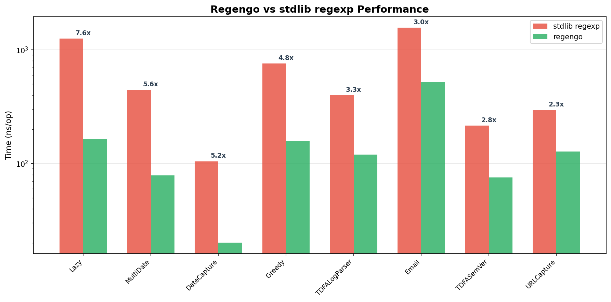

# Regengo

[](https://pkg.go.dev/github.com/KromDaniel/regengo)
[](https://goreportcard.com/report/github.com/KromDaniel/regengo)
[](https://codecov.io/github/KromDaniel/regengo)
[](https://opensource.org/licenses/MIT)

<p align="center">
  
</p>

Regengo is a **compile-time finite state machine generator** for regular expressions. It converts regex patterns into optimized Go code, leveraging the Go compiler's optimizations for type-safe, pattern-specific code generation.

## Table of Contents

- [Installation](#installation)
- [Quick Start](#quick-start)
- [Generated Methods](#generated-methods)
- [Capture Groups](#capture-groups)
- [Performance](#performance)
- [Streaming API](#streaming-api)
- [CLI Reference](#cli-reference)
- [Documentation](#documentation)
- [API Comparison](#api-comparison)
- [License](#license)

## Installation

```bash
go install github.com/KromDaniel/regengo/cmd/regengo@latest
```

## Quick Start

### CLI

```bash
regengo -pattern '(?P<year>\d{4})-(?P<month>\d{2})-(?P<day>\d{2})' \
        -name Date \
        -output date.go \
        -package main
```

### Library

```go
import "github.com/KromDaniel/regengo/pkg/regengo"

err := regengo.Compile(regengo.Options{
    Pattern:    `(?P<year>\d{4})-(?P<month>\d{2})-(?P<day>\d{2})`,
    Name:       "Date",
    OutputFile: "date.go",
    Package:    "main",
})
```

### Using Generated Code

```go
// Match
if CompiledDate.MatchString("2024-12-25") {
    fmt.Println("Valid date!")
}

// Find with captures
result, ok := CompiledDate.FindString("2024-12-25")
if ok {
    fmt.Printf("Year: %s, Month: %s, Day: %s\n", result.Year, result.Month, result.Day)
}

// Find all
matches := CompiledDate.FindAllString("Dates: 2024-01-15 and 2024-12-25", -1)
for _, m := range matches {
    fmt.Println(m.Match)
}
```

## Generated Methods

```go
type Date struct{}
var CompiledDate = Date{}

// Matching
func (Date) MatchString(input string) bool
func (Date) MatchBytes(input []byte) bool

// Finding (with captures)
func (Date) FindString(input string) (*DateResult, bool)
func (Date) FindStringReuse(input string, reuse *DateResult) (*DateResult, bool)
func (Date) FindBytes(input []byte) (*DateBytesResult, bool)
func (Date) FindBytesReuse(input []byte, reuse *DateBytesResult) (*DateBytesResult, bool)

// Finding all
func (Date) FindAllString(input string, n int) []*DateResult
func (Date) FindAllStringAppend(input string, n int, s []*DateResult) []*DateResult
func (Date) FindAllBytes(input []byte, n int) []*DateBytesResult
func (Date) FindAllBytesAppend(input []byte, n int, s []*DateBytesResult) []*DateBytesResult

// Streaming (for large files/network)
func (Date) FindReader(r io.Reader, cfg stream.Config, onMatch func(stream.Match[*DateBytesResult]) bool) error
func (Date) FindReaderCount(r io.Reader, cfg stream.Config) (int64, error)
func (Date) FindReaderFirst(r io.Reader, cfg stream.Config) (*DateBytesResult, int64, error)
```

### Generated Tests

Regengo automatically generates a `_test.go` file with correctness tests and benchmarks. See [Testing Guide](docs/testing.md) for details.

## Capture Groups

Named capture groups become typed struct fields:

```go
// Pattern: (?P<user>\w+)@(?P<domain>\w+)
type EmailResult struct {
    Match  string
    User   string  // from (?P<user>...)
    Domain string  // from (?P<domain>...)
}

result, ok := CompiledEmail.FindString("user@example.com")
if ok {
    fmt.Println(result.User, result.Domain)  // "user" "example"
}
```

### Zero-Allocation Reuse

For hot paths, reuse result structs to eliminate allocations:

```go
// Single match reuse
var reuse EmailResult
for _, input := range inputs {
    result, ok := CompiledEmail.FindStringReuse(input, &reuse)
    if ok {
        process(result.User, result.Domain)
    }
}

// FindAll with append reuse
var results []*DateResult
for _, input := range inputs {
    results = CompiledDate.FindAllStringAppend(input, -1, results[:0])
    for _, r := range results {
        process(r.Year, r.Month, r.Day)
    }
}
```

## Performance

Regengo consistently outperforms Go's standard `regexp` package:

| Pattern | Method | stdlib | regengo | Speedup |
|---------|--------|--------|---------|---------|
| Date `\d{4}-\d{2}-\d{2}` | FindString | 105 ns | 7 ns | **14x faster** |
| Multi-date extraction | FindAllString | 431 ns | 49 ns | **8.9x faster** |
| Email validation | MatchString | 1554 ns | 507 ns | **3x faster** |
| Log parser | FindString | 399 ns | 121 ns | **3.3x faster** |

<p align="center">
  
</p>

**Memory:** 50-100% fewer allocations. Zero allocations with `Reuse` variants.

See [Detailed Benchmarks](docs/benchmarks.md) for complete results.

## Streaming API

Process any `io.Reader` with constant memory. Unlike Go's `regexp.FindReaderIndex` which only finds the first match, Regengo finds **all matches** in a stream—handling buffering and cross-boundary matches automatically. Matches are delivered via callback, avoiding slice allocations and enabling true streaming semantics.

```go
file, _ := os.Open("server.log")
defer file.Close()

err := CompiledDate.FindReader(file, stream.Config{}, func(m stream.Match[*DateBytesResult]) bool {
    fmt.Printf("Found at offset %d: %s\n", m.StreamOffset, m.Result.Match)
    return true // continue
})
```

See [Streaming API Guide](docs/streaming.md) for details.

## CLI Reference

```
Required:
  -pattern string    Regex pattern to compile
  -name string       Name for generated struct
  -output string     Output file path

Basic:
  -package string    Package name (default "main")
  -test-inputs       Comma-separated test inputs
  -no-test           Disable test file generation

Analysis:
  -analyze           Output pattern analysis as JSON (no code generation)
  -verbose           Print analysis decisions

Advanced:
  -force-thompson    Force Thompson NFA (prevents ReDoS)
  -force-tdfa        Force Tagged DFA for captures
```

## Documentation

- [Streaming API](docs/streaming.md) - Processing large files and streams
- [Analysis & Complexity](docs/analysis.md) - Engine selection and guarantees
- [Unicode Support](docs/unicode.md) - Unicode character classes
- [Detailed Benchmarks](docs/benchmarks.md) - Complete performance data
- [Testing Guide](docs/testing.md) - Running and writing tests

## API Comparison

| stdlib `regexp` | regengo | Notes |
|-----------------|---------|-------|
| `MatchString(s)` | `MatchString(s)` | Identical |
| `FindStringSubmatch(s)` | `FindString(s)` | Returns typed struct |
| `FindAllStringSubmatch(s, n)` | `FindAllString(s, n)` | Returns `[]*Result` |
| - | `FindStringReuse(s, r)` | Zero-alloc reuse |
| - | `FindReader(r, cfg, cb)` | Streaming |

## License

MIT License - see [LICENSE](LICENSE) for details.
